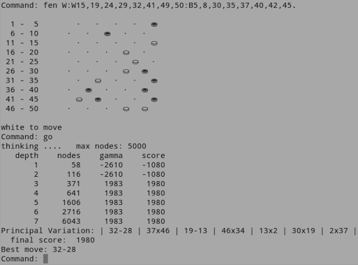

MAD100
======
MAD100 is a simple, but strong draughts engine, written in Python, mostly for teaching purposes.
It supports the international rules of 10x10 boards.

The clarity of the MAD100 code provides a great platform for experimenting, be it with evaluation functions, search extensions or anything. Fork it today and see what you can do!

Screenshot
==========

Run it!
=======
MAD100 is contained in four python files: mad100.py, mad100_moves.py, mad100_search.py, mad100_play.py 
Run it from the commandline with: *python mad100_play.py*
Answer with the command **h** for help.

Features
========
1. Built around the simple, but deadly efficient MTD-bi search algorithm.
2. Filled with game programming tricks for simpler and faster code.
3. Easily adaptive evaluation function through Piece Square Tables.
4. Uses standard Python collections and data structures for clarity and efficiency.

Limitations
===========
All input and output is done with the commandline.
Moves must be given in simple move notation, as shown in the screenshot.

The evaluation in MAD100 is not very sophisticated. E.g. we don't distinguish between midgame and endgame. Not much selective deepening is done, no threat detection and the like. Finally MAD100 might benefit from a more advanced move ordering, including such things as killer move.

Why MAD100?
===========
The name MAD refers to the reverse of DAM: the dutch name for the king of draughts. 
The number refers to the 100 squares of the board.
By the way: for python programmers it is not difficult to convert it to a 64 squares version.

Tags
====
draughts engine, MTD-bi search, alpha-beta pruning, fail soft, negamax, aspiration windows, null move heuristic,  opening book, quiescence search, iterative deepening, transposition table, principal variation, evaluation, piece square tables, FEN
